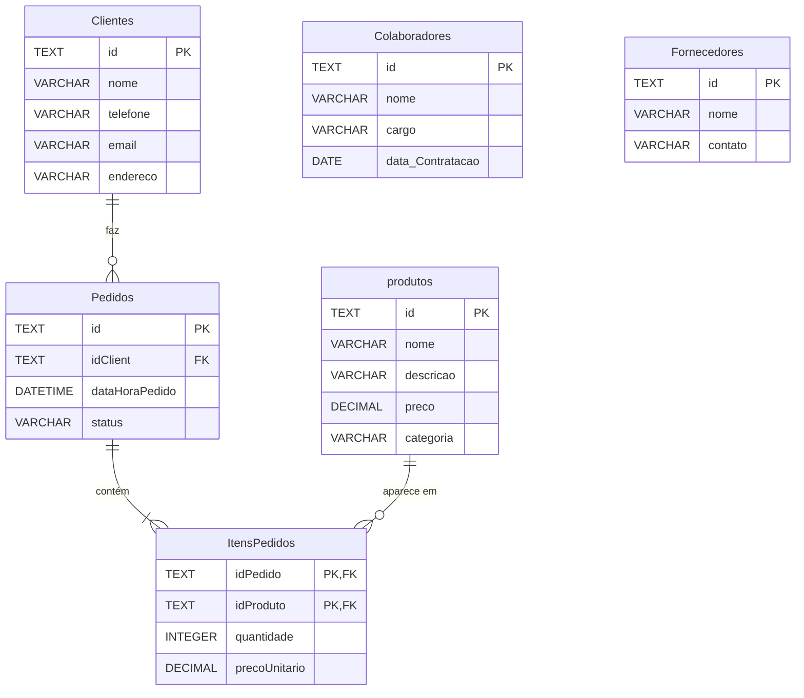

# Realizando Consultas no Café Serenato

Modelagem e análise de dados de uma cafeteria fictícia, o **Café Serenato**, usando SQL puro sobre SQLite.

O projeto parte de um banco vazio e constrói tudo: o schema relacional, a carga dos dados (via `INSERT` e via importação de CSV) e — em seguida — as consultas analíticas que respondem perguntas de negócio.

> **Origem:** projeto desenvolvido durante o curso _Realizando consultas com SQL: Joins, Views e transações_ da [Alura](https://www.alura.com.br).

## Os dados

| Tabela | Registros | Conteúdo |
|---|---:|---|
| `produtos` | 30 | Cardápio, em 6 categorias: Café, Chá, Almoço, Jantar, Sobremesa e Bebidas |
| `Clientes` | 26 | Cadastro de clientes |
| `Colaboradores` | 7 | Equipe, com cargo e data de contratação |
| `Fornecedores` | 6 | Fornecedores e seus contatos |
| `Pedidos` | 450 | Pedidos de jan a out/2023, com status `Em Andamento`, `Concluído` ou `Entregue` |
| `ItensPedidos` | 882 | Itens de cada pedido, com quantidade e preço unitário praticado |

`produtos`, `Clientes`, `Colaboradores` e `Fornecedores` são carregados por `INSERT`. `Pedidos` e `ItensPedidos` vêm dos arquivos CSV — volume alto demais para escrever à mão, o que é justamente o caso de uso da importação.

## Modelo de dados



`Colaboradores` e `Fornecedores` não se ligam às demais — são cadastros independentes.

Dois pontos de modelagem que valem nota:

- **`ItensPedidos` tem chave primária composta** (`idPedido`, `idProduto`). Não existe um `id` próprio: o que identifica a linha é o par pedido + produto, garantindo que o mesmo produto não apareça duas vezes no mesmo pedido.
- **`precoUnitario` é guardado no item, não lido de `produtos`.** É proposital: o preço do cardápio muda com o tempo, mas o pedido histórico precisa manter o valor que foi realmente cobrado.

## Estrutura

```
├── create_tables.sql    # Schema: DROPs + CREATE das 6 tabelas
├── inserindo_dados.sql  # Carga via INSERT (produtos, clientes, colaboradores, fornecedores)
├── inserindo_csv.sql    # Importação dos CSVs (pedidos e itens)
├── Pedidos.csv          # 450 pedidos
└── Itens de Pedido.csv  # 882 itens de pedido
```

O arquivo `.db` **não é versionado** — ele é gerado pelos scripts acima.

## Como reproduzir

Requer [SQLite 3](https://www.sqlite.org/download.html).

```bash
# 1. Cria o schema (apaga as tabelas antes, se existirem)
sqlite3 serenato_dados.db < create_tables.sql

# 2. Carrega os dados via INSERT
sqlite3 serenato_dados.db < inserindo_dados.sql

# 3. Importa os CSVs
sqlite3 serenato_dados.db < inserindo_csv.sql
```

Para conferir se deu certo:

```bash
sqlite3 serenato_dados.db "SELECT COUNT(*) FROM Pedidos;"   # 450
```

`create_tables.sql` é idempotente: pode rodar quantas vezes quiser que o resultado é sempre o mesmo banco limpo.

## Consultas analíticas

> 🚧 **Em construção.** Próxima etapa do projeto.

O objetivo é responder perguntas de negócio a partir do modelo — entre elas:

- Quais produtos mais vendem, em receita e em volume?
- Qual o ticket médio por pedido e como ele varia ao longo dos meses?
- Que categorias do cardápio sustentam o faturamento?
- Quais clientes concentram maior valor?
- Como os pedidos se distribuem por status e por horário do dia?

As consultas ficarão em `consultas.sql`, comentadas, com os achados registrados aqui.

## Anotações de estudo

O que cada etapa do projeto exercitou:

**Modelagem (`create_tables.sql`)**
- Tipos, `PRIMARY KEY`, `NOT NULL` e `DEFAULT` na definição das colunas
- Chave primária composta em `ItensPedidos`
- `FOREIGN KEY ... REFERENCES` para ligar as tabelas
- `ON DELETE CASCADE`: apagar um pedido leva junto os seus itens
- `PRAGMA foreign_keys = ON` — no SQLite as FKs vêm **desativadas** por padrão; sem esse comando as restrições não são verificadas
- `DROP TABLE IF EXISTS` em ordem inversa das dependências (filho antes do pai), deixando o script re-executável

**Carga de dados (`inserindo_dados.sql`, `inserindo_csv.sql`)**
- `INSERT INTO` com múltiplas linhas em um único comando
- Inserção parcial: omitir uma coluna para que o `DEFAULT` assuma (clientes sem e-mail)
- `.mode csv` + `.import --skip 1` para importar arquivos externos — o `--skip 1` descarta a linha de cabeçalho, e sem o `.mode csv` o SQLite não reconhece a vírgula como separador

---

Desenvolvido por **Nicholas Belo** · [@nickbelo2201](https://github.com/nickbelo2201)
