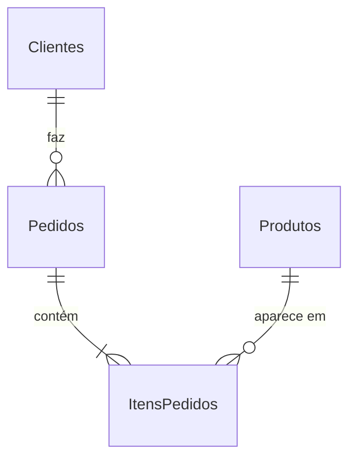

# Café Serenato: análise de vendas em SQL

Análise de 450 pedidos (jan a out/2023) de uma cafeteria fictícia, feita em **SQL puro sobre SQLite**, do banco vazio até as respostas de negócio.

> Projeto do curso _Realizando consultas com SQL: Joins, Views e transações_ ([Alura](https://www.alura.com.br)).

## Principais achados

- **Almoço sustenta o negócio:** 43% da receita. Chá e Bebidas, juntos, ficam abaixo de 8%.
- **O que vende mais não é o que fatura mais:** o Café da Casa lidera em volume (93 unidades), mas gera só R$ 186. O Salmão Grelhado lidera em receita (R$ 1.012).
- **Crescimento no 2º semestre:** o volume de pedidos triplicou entre abril e julho, e o ticket médio subiu de ~R$ 17 para ~R$ 22.
- **Operação concentrada na manhã:** o pico é das 8h às 10h, e o movimento praticamente acaba às 13h.
- **Sem dependência de clientes-chave:** nenhum cliente passa de 5,2% da receita.

Cada achado tem sua consulta em [`sql/04_analysis/`](sql/04_analysis).

## Dados e modelo



São 6 tabelas: `Produtos` (30), `Clientes` (28), `Pedidos` (450) e `ItensPedidos` (882), além dos cadastros de `Colaboradores` e `Fornecedores`. Os pedidos e itens vêm de CSV (`data/raw/`); o restante é carregado por `INSERT`.

Duas decisões de modelagem que valem nota:
- O preço fica gravado no item, e não é lido do cardápio. Assim o histórico preserva o valor que foi cobrado de fato.
- `precoUnitario` já é o total da linha, com a quantidade embutida. Por isso a receita é `SUM(precoUnitario)`.

## Estrutura

```
data/raw/          CSVs de origem
sql/01_schema/     criação das tabelas
sql/02_load/       carga (INSERT + importação de CSV)
sql/03_transform/  views
sql/04_analysis/   uma pergunta de negócio por arquivo
sql/exercicios/    exercícios do curso (joins, DML, transações, trigger)
scripts/           build_db.sh
```

## Como rodar

Requer [SQLite 3](https://www.sqlite.org/download.html).

```bash
sh scripts/build_db.sh
sqlite3 -header -column serenato_dados.db < sql/04_analysis/03_receita_por_categoria.sql
```

## Técnicas usadas

Modelagem relacional com PK composta, FK e `ON DELETE CASCADE` · importação de CSV · `JOIN`s (inner/left/right/full) · subconsultas · CTEs · agregações e `HAVING` · views · transações · triggers.

---

**Nicholas Belo** · [@nickbelo2201](https://github.com/nickbelo2201)
