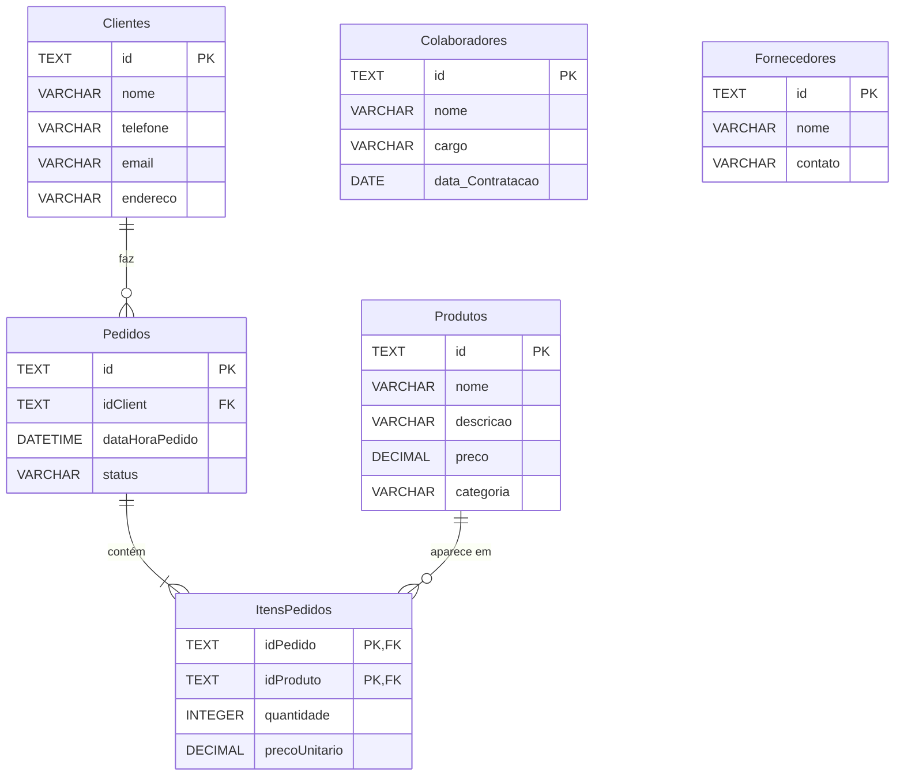

# Realizando Consultas no Café Serenato

Modelagem e análise de dados de uma cafeteria fictícia, o **Café Serenato**, usando SQL puro sobre SQLite.

O projeto parte de um banco vazio e constrói tudo: o schema relacional, a carga dos dados (via `INSERT` e via importação de CSV), uma camada de views e as consultas analíticas que respondem perguntas de negócio.

> **Origem:** projeto desenvolvido durante o curso _Realizando consultas com SQL: Joins, Views e transações_ da [Alura](https://www.alura.com.br).

## Os dados

| Tabela | Registros | Conteúdo |
|---|---:|---|
| `Produtos` | 30 | Cardápio, em 6 categorias: Café, Chá, Almoço, Jantar, Sobremesa e Bebidas |
| `Clientes` | 28 | Cadastro de clientes |
| `Colaboradores` | 7 | Equipe, com cargo e data de contratação |
| `Fornecedores` | 6 | Fornecedores e seus contatos |
| `Pedidos` | 450 | Pedidos de jan a out/2023, com status `Em Andamento`, `Concluído` ou `Entregue` |
| `ItensPedidos` | 882 | Itens de cada pedido, com quantidade e valor cobrado |

`Produtos`, `Clientes`, `Colaboradores` e `Fornecedores` são carregados por `INSERT`. `Pedidos` e `ItensPedidos` vêm dos CSVs em `data/raw/`, porque o volume é alto demais para escrever à mão, e esse é justamente o caso de uso da importação.

## Modelo de dados



`Colaboradores` e `Fornecedores` não se ligam às demais: são cadastros independentes.

Três pontos de modelagem que valem nota:

- **`ItensPedidos` tem chave primária composta** (`idPedido`, `idProduto`). Não existe um `id` próprio: o que identifica a linha é o par pedido + produto, garantindo que o mesmo produto não apareça duas vezes no mesmo pedido.
- **O preço é guardado no item, não lido de `Produtos`.** É proposital: o preço do cardápio muda com o tempo, mas o pedido histórico precisa manter o valor que foi realmente cobrado.
- **`precoUnitario` já é o valor total da linha.** Apesar do nome, a quantidade já está embutida (2 unidades de R$ 3,50 aparecem como `7.00`). Por isso as somas usam `SUM(precoUnitario)` sem multiplicar pela quantidade.

## Estrutura

```
├── data/
│   └── raw/                          # dados de origem, nunca editados
│       ├── pedidos.csv               # 450 pedidos
│       └── itens_pedido.csv          # 882 itens de pedido
├── sql/
│   ├── 01_schema/
│   │   └── 01_create_tables.sql      # DROPs + CREATE das 6 tabelas
│   ├── 02_load/
│   │   ├── 01_insert_cadastros.sql   # INSERT de produtos, clientes, colaboradores, fornecedores
│   │   └── 02_import_csv.sql         # importação dos CSVs
│   ├── 03_transform/                 # camada modelada (views)
│   │   ├── vw_gastos_clientes.sql
│   │   └── vw_faturamento_diario.sql
│   ├── 04_analysis/                  # uma pergunta de negócio por arquivo
│   └── exercicios/                   # material do curso: joins, subconsultas, DML, transações, trigger
└── scripts/
    └── build_db.sh                   # reconstrói o banco do zero
```

O arquivo `.db` **não é versionado**: ele é gerado pelos scripts.

## Como reproduzir

Requer [SQLite 3](https://www.sqlite.org/download.html). A partir da raiz do repositório:

```bash
sh scripts/build_db.sh
```

O script roda, em ordem, `01_schema` → `02_load` → `03_transform` e mostra a contagem final (450 pedidos, 882 itens). Pode rodar quantas vezes quiser: o resultado é sempre o mesmo banco limpo.

Para rodar uma análise:

```bash
sqlite3 -header -column serenato_dados.db < sql/04_analysis/02_ticket_medio_mensal.sql
```

Os scripts de `exercicios/` alteram dados (UPDATE, DELETE, trigger). Depois de rodá-los, reconstrua o banco com `build_db.sh`.

## Consultas analíticas

| Pergunta | Arquivo | Achado |
|---|---|---|
| Quais produtos mais vendem? | `01_produtos_mais_vendidos.sql` | **Salmão Grelhado** lidera em receita (R$ 1.012). Em volume, lidera o **Café da Casa** (93 un.), que gera só R$ 186 |
| Como varia o ticket médio? | `02_ticket_medio_mensal.sql` | Subiu de ~R$ 17 (jan/fev) para ~R$ 22 a partir de junho. O volume de pedidos triplicou entre abril e julho |
| Que categorias sustentam o faturamento? | `03_receita_por_categoria.sql` | **Almoço** responde por 43% da receita. Chá e Bebidas somam menos de 8% |
| Quais clientes concentram valor? | `04_clientes_top_valor.sql` | A receita é bem distribuída: nenhum cliente passa de 5,2% do total |
| Como se distribuem status e horário? | `05_pedidos_status_horario.sql` | Os status estão equilibrados (~1/3 cada). O movimento se concentra das 8h às 10h e praticamente acaba às 13h |

## Anotações de estudo

O que cada etapa do projeto exercitou:

**Modelagem (`01_schema`)**
- Tipos, `PRIMARY KEY`, `NOT NULL` e `DEFAULT` na definição das colunas
- Chave primária composta em `ItensPedidos`
- `FOREIGN KEY ... REFERENCES` para ligar as tabelas
- `ON DELETE CASCADE`: apagar um pedido leva junto os seus itens
- `PRAGMA foreign_keys = ON`: no SQLite as FKs vêm **desativadas** por padrão, e sem esse comando as restrições não são verificadas
- `DROP TABLE IF EXISTS` em ordem inversa das dependências (filho antes do pai), deixando o script re-executável

**Carga de dados (`02_load`)**
- `INSERT INTO` com múltiplas linhas em um único comando
- Inserção parcial: omitir uma coluna para que o `DEFAULT` assuma (clientes sem e-mail)
- `.mode csv` + `.import --skip 1` para importar arquivos externos. O `--skip 1` descarta a linha de cabeçalho, e sem o `.mode csv` o SQLite não reconhece a vírgula como separador

**Consultas (`exercicios/`)**
- `UNION ALL`, subconsultas com `=`, `IN` e `HAVING`
- `INNER`, `LEFT`, `RIGHT` e `FULL JOIN`
- Views (`CREATE VIEW`) para reaproveitar consultas
- `UPDATE`, `DELETE` e transações (`BEGIN` / `ROLLBACK` / `COMMIT`)
- Triggers (`AFTER INSERT`). Na análise, o faturamento diário virou a view `vw_faturamento_diario`, que é sempre atual e não recalcula a tabela inteira a cada item inserido

---

Desenvolvido por **Nicholas Belo** · [@nickbelo2201](https://github.com/nickbelo2201)
